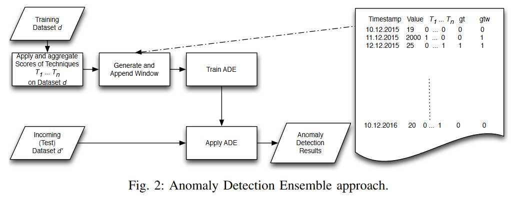

# ADE_An_Ensemble_Approach_for_Early_Anomaly_Detection
***
## Introduction    
说明异常检测的定义、应用领域，介绍了主动异常检测的概念，主动异常检测指的是提前检测到即将发生的异常。通过主动异常检测有显著的好处。 
- 提出当前异常检测的挑战：
随着系统的复杂性和收集数据的规模不断增加，手动选择和调整机器学习技术变得不切实际，这是一个成本高昂、耗时且通常是试错的过程。
&emsp;
- 本文贡献：
作者们提出了**ADE，一种主动异常检测集成方法**，该方法通过机器学习和集成学习来解决异常检测问题。ADE结合了多种最先进的异常检测技术的结果，以提供比单一技术更准确的结果。
细节：ADE使用加权异常窗口作为训练模型的标签，该窗口优先考虑早期检测，以便及时地发现异常。 
***
## Related Work  
作者回顾了与异常检测相关的现有工作
- 基于阈值的方法  
作者讨论了两类基于阈值的异常检测方法：参数方法和非参数方法。参数方法假设数据集的底层分布，并基于该分布确定阈值。然而，这种假设在实践中往往是不现实的，而且经常被违反。非参数方法则避免做出这样的假设，但是以一种特别的方式确定阈值。
作者指出这些基于阈值的方法通常是不现实的，不适应传入数据集的模式变化，并且通常需要大量的工作来调整阈值值。
&emsp;
- 集成多个技术的系统
  文章提出了一些系统采用了多种现有的异常检测技术，但它们使用的是相对简单的方法，如Skyline系统采用投票机制来确定结果。
&emsp;
- ADE使用的异常检测技术
  本文提出ADE方法将使用四种现有的异常检测技术，简要介绍每种技术：
  1）**IBM SPSS Anomaly Detection:** 使用基于聚类的方法来检测数据集中的异常。
  2）**NuPIC (Numenta Platform for Intelligent Computing):** 一个基于新皮层理论的开源项目，称为层次时间记忆（HTM），适用于在线实时应用。
  3）**Etsy Skyline:** 使用多种简单的异常检测技术和通过投票机制计算异常分数。
  4）**AnomalyDetection (Twitter):** 基于统计技术的组合，使用Generalized ESD测试和稳健的统计指标来检测异常。
  作者强调ADE方法的目的是利用这些现有技术的输出结果来训练集成模型，而不需要选择单一的技术，因为模型会根据数据集的考虑学习每种技术的准确性，并相应地应用权重。 
  ***
  ## ADE: EARLY ANOMALY DETECTION ENSEMBLE
- ADE训练步骤：
1）数据预处理
2）使用标签生成异常窗口
3）使用生成的标签窗口（步骤2生成）来训练模型
4）新输入和测试数据集中应用模型并收集结果
具体ADE方法如下图所示：

&emsp;
- 实现细节：
1）**数据预处理：**
应用现有的异常检测技术$T_j$到标记的数据集d上，生成每个技术在给定数据集上的分数。
将每个技术生成的分数聚合到一个文件中，用于训练目的。
注:现有技术$T_j$是上一部分中提到的四种技术  
2）**异常窗口生成：**
使用不同的策略来生成集成模型的标签窗口（ground truth windows），以研究它们的影响     
Ⅰ）**Ground Truth Window (gtw):** 
此策略为整个异常窗口 awd(a) 内的每个时间点赋予相同的权重（值为1），窗口外的时间点权重为0。这种策略的目的在于检验是否可以通过在整个异常窗口内赋予最大权重来提高检测性能。      
Ⅱ）**Earliest Detection (gtwed):** 
此策略旨在通过给予最早检测到异常的技术更高的权重来优先考虑早期检测。
权重（概率p）从1开始，随着时间点接近窗口内实际异常发生的时间而递减，直到达到异常发生的时间点。
权重设计为在异常窗口的开始给予最大的权重，并随着接近异常点而逐渐减小，以此来训练模型更倾向于早期的异常检测。  
Ⅲ）**Before Earliest Detection (gtwbfed):** 
此策略检查是否可以利用在任何技术检测到异常之前给出的分数来让ADE提前检测到异常。
权重从异常检测前的某个时间点开始，随着接近异常发生的时间而递减，目的是探索在异常被明确检测到之前模型是否能够识别出异常迹象。  
Ⅳ）**Ground Truth Label (gtwgtl):** 
此策略通过给予最接近地面真实标签（即实际异常发生的时间点）的技术更高的权重来优先考虑更准确的检测。
这种方法的目标是训练模型以识别与已知异常最一致的异常模式。  
Ⅴ）**Before Ground Truth Label (gtwbfgtl):** 
结合了准确检测和早期检测的目标，通过给予在异常发生前且接近地面真实标签的时间点更高的权重。
这种方法旨在训练模型在保持准确性的同时，尽可能提前地识别异常。  
Ⅵ）**Discrete (gtwdiscr):** 
此策略在异常实际发生的时间点赋予权重1，其他时间点赋予权重0，以此来强调异常发生的确切时间点。  
Ⅶ）**Discrete Probabilistic (gtwdiscrprob):** 
类似于离散策略，但在异常未发生的时间点赋予一个小的非零权重（如0.5），而不仅仅是0，以允许模型在异常发生前后都有一定的检测能力。  
3）**训练ADE：**
使用XGBboost库训练集成模型，该库是一个优化的分布式梯度提升库，以其高效和准确性而闻名。
训练时使用由现有技术生成的分数。 
4）**应用ADE：**
ADE将结合多个现有异常检测技术的结果，基于先前学习的准确性，以检测异常。
***
## EVALUATION
作者介绍用于评估ADE性能的实验设计、所使用的数据集、评估指标以及使用结果。
1.数据集
- 使用Numenta Anomaly Benchmark提供的一组带标签的真实世界的时序数据集
- 将测量相同指标的数据集（如CPU、rds-cpu、network）合并为每个指标的一个数据集，以扩大用于集成模型训练的数据集
- 选择跨越多个文件的数据集进行评估，因为每个文件通常只包含一个或两个真实异常
- 将数据分为训练集和测试集，训练集占80%，测试集占20%

2.评估指标
检测窗口定义：
$$aw_{d}^{a} = [ t_b , t_e ]$$
- **早期检测（Early Detection）：** 通过绝对时间和检测的索引来比较不同技术发现所有异常的时间和排名
- **早期检测分数（ed score）：** 评估一个异常a相对于异常窗口的早期检测情况。分数介于0和1之间，其中1表示在区间开始发现异常，0表示区间结束发现异常。分数定于如下：
$$
ed_a(T_j) = 
\begin{cases} 
1-\frac{pos_d(T_j(a))-b}{e-b} & \text{if } a \in A_d^{T_j} \\
0 & \text{if } a \notin A_d^{T_j} 
\end{cases}
$$
注：其中$A_d^{T_j}$表示在检测窗口$aw_{d}^{a}$中异常被技术$T_j$在数据集d中发现，$T_j(a)$表示在检测窗口中$aw_{d}^{a}$通过技术$T_j$在数据集d中第一次发现异常a的时间，之后对异常a的检测将被忽略。
- **精确度（precision）和召回率（Recall）：**
  如果使用技术$T_j$在窗口$aw_{d}^{a}$被检测，但是不是在$pos_d(a)$的准确位置，在计算召回率和精确度都会被视为发现真实异常。

3.结果
实验结果证明ADE方法在ed分数上表现超过其他计算，平均提前约6个小时，精确度方向取决窗口生成策略。
文章的评估部分通过一系列实验和指标来验证 ADE 方法的有效性，展示了其在早期异常检测、精确度和召回率方面相对于现有技术的优越性。这些结果支持了 ADE 方法作为早期异常检测集成方法的潜力。

