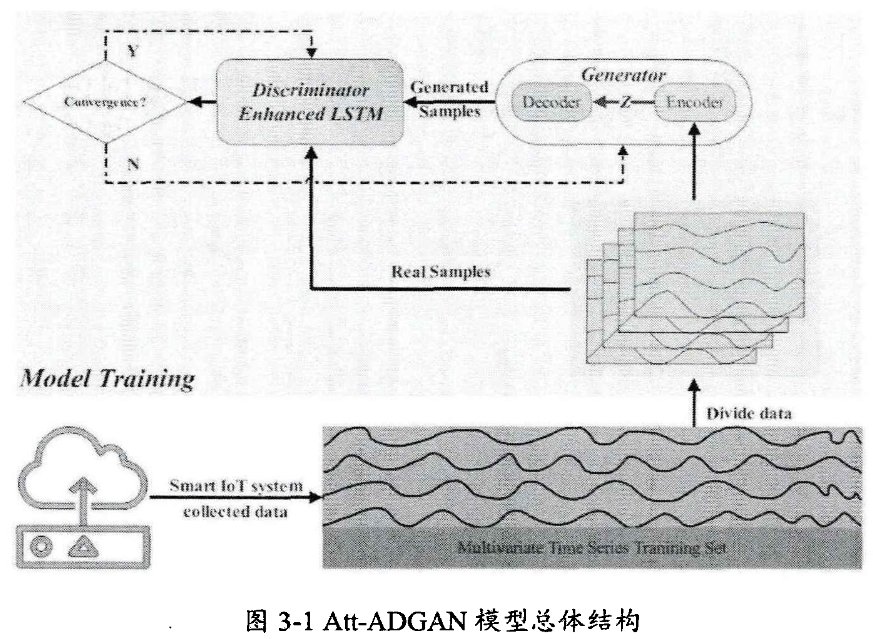
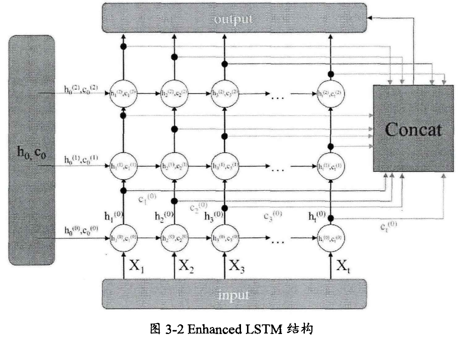
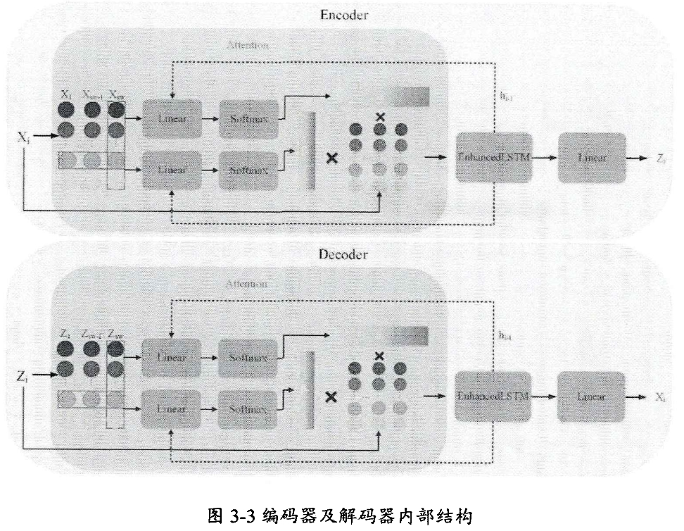
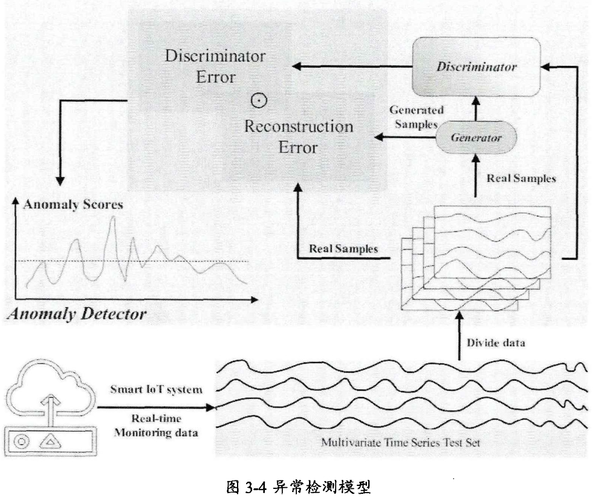

# 基于深度学习的智能物联网时序数据异常检测
***
## 本文贡献
- 阐述基于GAN的异常检测及轻量化算法流程
- 针对智能物联网产生的**高维时序数据**，提出了基于GAN且包含注意力机制的异常检测模型**Att-ADGAN（Attention-Anomaly Detction GAN）**
- 针对计算及存储**资源受限**的边缘设备，在Att-ADGAN的基础上，提出了**两阶段知识蒸馏框架S-KDGAN**
***
##  基于GAN的异常检测模型Att-ADGAN
### 模型架构

Att-ADGAN使用**LSTM作为生成器和判别器**的基本模型来处理复杂的多维时间序列数据。
对于多维时间序列数据，将数据划分为**子序列**，子序列通过滑动窗口机制被送到模型中，窗口大小设置为：
$s_w = 30\times i,i=1,2,\dots,n$
- 模型训练步骤
- 1.数据预处理
1）将数据集划分为训练集、验证集和测试集
2）其中**训练集需要全部为正常数据**，确保模型准确学习到正常数据的分布模式
3）训练集和验证集被大小为$s_w$的滑动窗口划分为统一的子序列，需要对验证数据集进行标记

- 2.模型训练
**生成器试图通过编码器-解码器架构生成类真实样本欺骗判别器，判别器将尽可能区分出生成样本与真实样本**
1）通过GAN模型学习数据
分别**对抗学习**两个映射函数$\varepsilon : X \rightarrow Z$和$G : Z \rightarrow X$(其中X是训练样本，Z是潜在空间向量)
通过两个映射函数可以实现数据重构$x_i \rightarrow \varepsilon(x_i) \rightarrow G(\varepsilon(x_i)) \approx x_i$
2）训练细节
为确保模型学习到正态数据的分布模式。**训练阶段输入数据全是正常数据**
将生成器的**输出**$\bold{G(\varepsilon(x_i))}$和**原始数据** $\bold{x_i}$发送到判别器进行训练
3）损失函数定义
通过G和D的对抗训练不断提高其性能，直到达到设定的迭代次数或模型收敛
**对抗损失**：生成器会尽量减少损失，判别器试图最大化损失
$$L_{adv} = E_{X\sim pX}[\log(D(X))]+E_{X\sim pX}[\log(1-D(\varepsilon(X)))] \tag{1}$$
注：其中$D(X)$是判别器输出，$E_{X \sim pX}$表示从实空间采样的真实样本，$\log(D(X))$表示判别器预期原始样本为真，$\log(1-D(\varepsilon(X)))$表示预期生成的样本为假。
**特征损失**：$$L_{fea} =  E_{X\sim pX} \|f(X) - f(G(\varepsilon(X)))\|_{2} \tag{2}$$
注：其中f(*)是判别器最后一层输出，损失是f(X)和$f(G(\varepsilon(X)))$的L2范数。
**映射损失**：为确保原始数据$x_{i}$可以映射到潜空间$z_{i}$，最小化原始与重构样本的残差的L2范数
$$L_{map} = E_{X \sim pX}\| X - G(\varepsilon(x)) \|_{2} \tag{3}$$
**总损失**：$$L_{G} = \lambda_{a}L_{adv} + \lambda_{f}L_{fea} + \lambda_{m}L_{map} \tag{4}$$
注：$\lambda_{a}$,$\lambda_{f}$和$\lambda_{m}$表示权重

- 3.生成器与判别器
  为提高重构效果，将生成器和判别器的**基本模型改进为Enhanced LSTM结构**,Enhanced LSTM结构如下所示：

在编码器和解码器**之前连接一个注意力模块**，结构如下所示：

第一阶段，在**时间维度**上执行注意力计算，时间维度的重要性$a_{ij}$通过式(5)和(6)计算，如下：
$$S_{i}^{time}=tanh(W_{h}^{a}\cdot h_{i-1}+X_{i}^{T}w_{x}^{a}+b^{a})\tag{5}$$
$$a_{ij}=\frac{exp(s_{ij}^{time})}{\Sigma_{j^{\prime}=1}^{S_{w}}exp(s_{ij^{\prime}}^{time})},j=1,2,\cdots,S_{w}\tag{6}$$
第二阶段，在**特征维度**上执行注意力计算，特征维度的重要性$b_{ij}$通过式(5)和(6)计算，如下：
$$S_{i}^{feature}=tanh(W_{h}^{\beta}\cdot h_{i-1}+X_{i}^{T}w_{x}^{\beta}+b^{\beta})\tag{7}$$
$$b_{ij}=\frac{exp(s_{ij}^{feature})}{\Sigma_{k^{\prime}=1}^{d}exp(s_{ik^{\prime}}^{feature})},k=1,2,\cdots,d\tag{8}$$
经过注意力机制，提高输入的**特征和时间相关性**，之后在输入到Enhanced LSTM中。
***
### 异常检测
异常检测过程如图所示：

- 1.异常检测细节
使用与训练集相同的数据预处理方法，根据时间窗口将标记测试集划分为子序列。
将驻点误差与曲线相似度组合为最终的异常分数。
驻点误差：$$l_{d} = \sum_{i=1}^{n}|x_{t}^{test,i} - G(\varepsilon(x_{t}^{test,i}))|\tag{9}$$
注：$x_{t}^{test,i} \in R^{n}$为t时刻第i个变量的测量值
曲线相似度（使用DTW算法）：$$S_t=W^{*}=DTW(X,\hat{X})=min\Bigg[\frac{1}{k} \sqrt{\sum_{k=1}^{k}w_k}\Bigg]\tag{10}$$
最终重构误差：$L_R=\alpha L_d + \beta S_t$
- 2.实验部分
  使用数据集：SWMRU、KDDCup99、HomeC
  评估指标：精度（Precision）、召回率（Recall）和F1分数
  $$Pre = \frac{TP}{TP+FP}$$
  $$Rec = \frac{TP}{TP+FN}$$
  $$F1 = 2 \times \frac{Pre \times Rec}{Pre - Rec}$$
  注：TP（True Positives）：是正确检测到异常
  FP（False Positives）是错误检测到正常
  TN（True Negatives）是正确检测到正常
  FN（False Negatives）是错误检测到正常