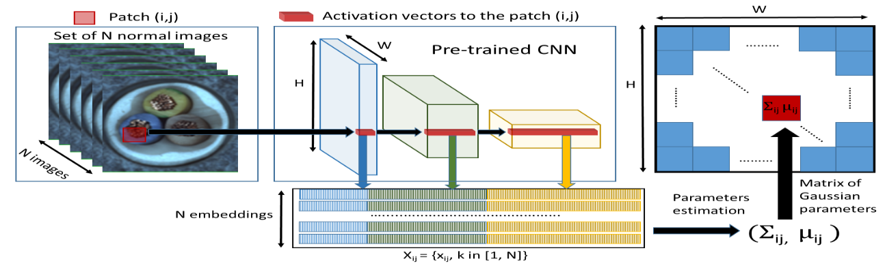

# PaDim : a Patch Distribution Modeling Framework for Anomaly Detection and Localization
*** 
本文提出一个名为PaDiM（Patch Distribution Modeling）的新框架，它用于在单类学习设置中同时检测和定位图像中的异常。PaDiM利用预训练的卷积神经网络（CNN）进行图像词向量表示，并使用多变量高斯分布来获得正常类别的概率表示。此外，PaDiM还利用CNN不同语义层次之间的相关性来更好地定位异常。
***
## introduction
介绍了图像异常检测的任务，并说明必要性。
还讨论了现有方法的局限性，包括它们可能需要深度神经网络训练，或者在测试时使用K-最近邻（K-NN）算法，这可能会随着训练数据集的增长而增加时间和空间复杂性。
作者提出了PaDim模型，Padim使用预训练的CNN进行词向量提取，并具有两个特点：每个像素块位置由多变量高斯分布描述；PaDiM考虑了预训练CNN不同语义层次之间的相关性。
***
## RELATED WORK
作者详细讨论了异常检测和定位方法，并将这些方法分为两大类：基于重建的方法和基于词向量相似性的方法
1) **基于重建的方法：** 这类方法广泛用于异常检测和定位。使用的神经网络架构包括自编码器（AE）、变分自编码器（VAE）和生成对抗网络（GAN）。这些模型仅在正常训练图像上进行训练以重建图像。因此，异常图像可以作为重建效果不佳的图像被识别出来。在图像级别上，最简单的方法是将重建误差作为异常分数。此外，还可以使用潜在空间、中间激活或判别器的额外信息来更好地识别异常图像。然而，基于重建的方法的性能受限于自编码器有时也能为异常图像提供良好的重建结果。
2) **基于词向量相似性的方法：** 这些方法使用深度神经网络提取有意义的向量，描述整个图像进行异常检测或图像块进行异常定位。这些方法通常给出有希望的结果，但往往缺乏可解释性，因为无法知道异常图像的哪一部分导致了高异常分数。在这种情况下，异常分数是测试图像的嵌入向量与代表训练数据集中正常性的参考向量之间的距离。正常的参考可以是包含正常图像嵌入的n-sphere的中心、高斯分布的参数或整个正常嵌入向量集合。

最后，作者提出的方法PaDiM生成用于**异常定位的补丁词向量**，类似于上述方法。然而，PaDiM通过一组高斯分布来描述正常类别，这些分布还模拟了使用的预训练CNN模型的语义层次之间的相关性。作者使用预训练网络来训练，所以预测阶段的时间复杂性低，且与训练数据集的大小无关。预训练网络包括ResNet、Wide-Resnet和EffcientNet。
***
## PATCH DISTRIBUTION MODELING
作者详细介绍了PaDiM框架的三个核心组成部分：嵌入提取（Embedding extraction）、正常性的学习（Learning of the normality）以及推断：异常图的计算（Inference: computation of the anomaly map）,模型如下：

1) 嵌入提取 (Embedding extraction)
   PaDiM使用预训练的卷积神经网络（CNN）来生成补丁嵌入向量。在训练阶段，正常图像的每个补丁与其在预训练CNN激活图中空间对应的激活向量相关联。不同层的激活向量被连接起来，形成包含不同语义层次和分辨率信息的嵌入向量，以编码细粒度和全局上下文。由于激活图的分辨率低于输入图像，许多像素具有相同的嵌入，从而在原始图像分辨率中形成无重叠的像素补丁。因此，输入图像可以被划分为一个网格，每个网格位置(i, j)与一个嵌入向量xij相关联。
2) 正常性的学习 (Learning of the normality)
 为了学习位置(i, j)的正常图像特征，首先计算N个正常训练图像在(i, j)处的补丁嵌入向量集合Xij。通过假设Xij是由多变量高斯分布N(µij, Σij)生成的，其中µij是Xij的样本均值，样本协方差Σij是这样估计的：
$$\Sigma_{ij} = \frac{1}{N-1}\sum_{k=1}^{N}(x_{ij}^{k} - \mu_{ij})(x_{xj}^{k} - \mu_{ij})^{T} + \varepsilon I$$
这里的正则化项$\varepsilon I$$确保样本协方差矩阵$\Sigma_{ij}$是满秩且可逆的。最终，每个可能的补丁位置与一个多变量高斯分布相关联，该分布捕获了不同层次的信息以及层间的相关性。
1) 推断：异常图的计算 (Inference: computation of the anomaly map)
   